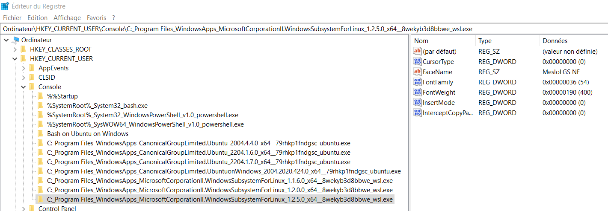

# One clic change > WSL colors

Just a backup in case the [original repo](https://github.com/nsilvestri/solarized-dark-for-wsl) vanishes.

Comment ? Télécharger le repo, et lancer `one-click-through-powershell-colors.vbs`. Relancer le terminal (WSL Ubuntu). C'tout.

📝 `one-click-through-powershell-colors.vbs` > Evite de devoir lancer powershell en admin et exécuter le script à la main.

🦄 Pour wam : `_one-click-through-powershell-colors-fonts-layout.vbs`, rajoute la config de police `MesloLGS NF` & taille de terminal 150 x 30.

---

Adapted the Ubuntu-fier for use with Solarized Dark, and took away the font installing part, so now all it does is change registry keys. To use, just download the zip, extract, and run `install.vbs`.

💩👴 KO / You're probably better off just using this [pure registry version](https://gist.github.com/noelbundick/d7d67c1cc9cae8a1cb93240dc7bbe78c#file-solarized-dark-reg).

---

## 🐛 Windows 11 / Script KO

Si l'exécution du script ne fonctionne pas, et que le lancement du script `.ps1` renvoie une erreur via powershell, adapter en fonction de l'erreur.

~`exécution de script est désactivée sur ce système` :

[Résolution](https://www.pcastuces.com/pratique/astuces/3908.htm) :

1. Lancer Powershell en mode administrateur
2. `Set-ExecutionPolicy RemoteSigned`
3. Appuyer sur "O" afin d'autoriser les scripts
4. Valider
5. Relancer le script

---

## Max > Correspondances couleurs

| SOLARIZED | HEX     | ANSI      | TERMCOL   | cmd.exe     | PowerShell  | ColorTable | DWORD    | RGB pour c/c shame | DECIMAL  |
|-----------|---------|-----------|-----------|-------------|-------------|------------|----------|--------------------|----------|
| base03    | #002b36 | ESC[0;30m | brblack   | Black       | Black       | 00         | 00362b00 | 0     43    54     | 3549952  |
| base02    | #073642 | ESC[1;30m | black     | Gray        | DarkGray    | 08         | 00423607 | 7     54    66     | 4339207  |
| base01    | #586e75 | ESC[0;32m | brgreen   | Green       | DarkGreen   | 02         | 00756e58 | 88    110   117    | 7695960  |
| base00    | #657b83 | ESC[0;33m | bryellow  | Yellow      | DarkYellow  | 06         | 00837b65 | 101   123   131    | 8616805  |
| base0     | #839496 | ESC[0;34m | brblue    | Blue        | DarkBlue    | 01         | 00969483 | 131   148   150    | 9868419  |
| base1     | #93a1a1 | ESC[0;36m | brcyan    | Aqua        | DarkCyan    | 03         | 00a1a193 | 147   161   161    | 10592659 |
| base2     | #eee8d5 | ESC[0;37m | white     | White       | Gray        | 07         | 00d5e8ee | 238   232   213    | 14018798 |
| base3     | #fdf6e3 | ESC[1;37m | brwhite   | BrightWhite | White       | 15         | 00e3f6fd | 253   246   227    | 14939901 |
| yellow    | #b58900 | ESC[1;33m | yellow    | LightYellow | Yellow      | 14         | 000089b5 | 181   137   0      | 35253    |
| orange    | #cb4b16 | ESC[0;31m | brred     | Red         | DarkRed     | 04         | 00164bcb | 203   75    22     | 1461195  |
| red       | #dc322f | ESC[1;31m | red       | LightRed    | Red         | 12         | 002f32dc | 220   50    47     | 3093212  |
| magenta   | #d33682 | ESC[1;35m | magenta   | LightPurple | Magenta     | 13         | 008236d3 | 211   54    130    | 8533715  |
| violet    | #6c71c4 | ESC[0;35m | brmagenta | Purple      | DarkMagenta | 05         | 00c4716c | 108   113   196    | 12874092 |
| blue      | #268bd2 | ESC[1;34m | blue      | LightBlue   | Blue        | 09         | 00d28b26 | 38    139   210    | 13798182 |
| cyan      | #2aa198 | ESC[1;36m | cyan      | LightAqua   | Cyan        | 11         | 0098a12a | 42    161   152    | 10002730 |
| green     | #859900 | ESC[1;32m | green     | LightGreen  | Green       | 10         | 00009985 | 133   153   0      | 39301    |

---

## Edit 2023 : 🧽 Go clean AF

Ca a re-sauté, on creuse et on fait ça propre.

✅🐛FIX: Le nom de la clé dans le registre a changé : ne contient plus `*ubuntu*`, est devenu **"WindowsSubsystemForLinux"**.

📝 Pistes supplémentaires repo [WSL Ubuntu bash console colors](https://github.com/MuTLY/wsl-ubuntu-bash-colors) > le fichier `.ps1` est plus abouti.

---

### Concrètement, comment ça marche ?

Si on scanne rapidement le script `change_font_colors.ps1`, cela va modifier des clés de registre.

Et plus spécifiquement

```bash
Get-ChildItem "HKCU:\Console\*ubuntu*" | ForEach-Object {
```

Dans "HKCU" > Console > Chacune des entrées qui comporte la chaîne "ubuntu".

Go checker dans le registre : Windows > Ouvrir le menu > Taper "registre" > Clic droit > Ouvrir en tant qu'admin.


---

"HKCU" correspond à 📂 HKEY_CURRENT_USER > 📂 Console

On retrouve l'ensemble des configs pour l'ensemble des terminaux (Windows bash, Powershell, WSL)



---

Si on check les anciennes versions, on peut voir les valeurs ajoutées par le script ou à la main


---

Juste pour être sur, on rajoute une valeur


---

Cay good.

On met à jour le script afin de taper **(pour le moment -_-)** sur les clés "WindowsSubsystemForLinux".

---

### Personnaliser

1. Ouvrir le registre.
2. Ouvrir le terminal > préférences
3. Modifier l'une des préférences
4. Mettre à jour le registre (passer sur une autre clé & revenir sur la bonne)
5. Voir quelle entrée à changée / été ajoutée / supprimée (cf. image fond rouge)
6. Ajuster le script.ps1 en conséquence

---

## 💩 c/c shame RGB

Si vraiment cela ne fonctionne plus.

Tout copier coller dans les valeurs RGB des 16 boites de couleurs (Propriétés > Couleurs) 🙈 **sans tenir compte de l'aperçu**.


---

## 💾🗚 Add backup for font

Originally from [zsh theme > powerlevel10k](https://github.com/romkatv/powerlevel10k#meslo-nerd-font-patched-for-powerlevel10k).

`MesloLGS NF` font backup in the [fonts folder](./fonts).
